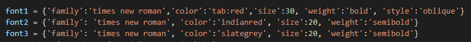

## **PANDS-PROJECT 2021**
### Author: Sarah McNelis
&nbsp; 
### **Introduction** 
The aim of this project is to research, investigate and analyse Fisher's Iris data set. I have written a program in python to complete this task. First let's take a look at the man behind the data set:
&nbsp;
### **Ronald Fisher**
Sir Ronald Fisher (17 February 1890 – 29 July 1962) was a British statistician, eugenicist, and biologist. Fisher's Iris data set also known as the Iris flower data set. It is a multivariate data set introduced by Ronald Fisher in his 1936 paper "The use of multiple measurements in taxonomic problems" as an example of linear discriminant analysis. 
<<https://en.wikipedia.org/wiki/Iris_flower_data_set>>
&nbsp;
#  
&nbsp;
### **Iris Flower Data Set**
The dataset contains a set of 150 records under five attributes - sepal length, sepal width, petal length, petal width and species. These records are broken down into three species: Iris-Setosa, Iris-Versicolor and Iris-Virginica. Each species contains 50 records each. This data set became a typical test case for many statistical classification techniques in machine learning such as support vector machines. 
<<https://www.kaggle.com/arshid/iris-flower-dataset>>
&nbsp;
# 
&nbsp;

# downloaded csv iris data set
# https://www.kaggle.com/saurabh00007/iriscsv
# downloaded .data @
# http://archive.ics.uci.edu/ml/datasets/Iris 
# http://archive.ics.uci.edu/ml/machine-learning-databases/iris/

### - 
# 1.**heading** #bold
# > for quote

#### brief intro. maybe some pics? ## note to self - look up markdown syntax on how to do this

## para here to explain different **variables**

## new para here to explain ** writing to text file**

## new para here to explain **histogram of each variable**

## new para here to explain ** scatter for each variable**

# eg of how to add screensnip by pushing png file to repository
## https://www.foxinfotech.in/2019/12/github-markdown-add-an-image-to-readme-md-file.html#:~:text=1%20Add%20an%20existing%20Image%20to%20README.md%20file,...%203%20Add%20an%20Image%20from%20External%20Resource

# 

## **REFERENCES:** #big heading 