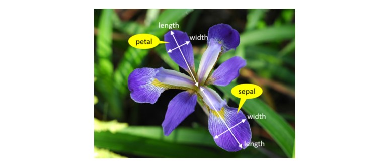

## **PANDS-PROJECT 2021**
### Author: Sarah McNelis
&nbsp;
### **Introduction** 
The aim of this project is to research, investigate and analyse Fisher's Iris data set. I have written a program in python to complete this task. First let's take a look at the man behind the data set.
&nbsp;
### **Ronald Fisher**
Sir Ronald Fisher (17 February 1890 – 29 July 1962) was a British statistician, eugenicist, and biologist. One of his most popular developments was the Iris flower data set also known as Fisher's Iris data set. It is a multivariate data set introduced by Ronald Fisher in his 1936 paper on _The use of multiple measurements in taxonomic problems_ as an example of linear discriminant analysis(LDA). The purpose of LDA is to portray the difference between classes of data.
#  
### **Iris Flower Data Set**
The dataset contains a set of 150 records under five attributes - sepal length, sepal width, petal length, petal width and species. 
# 
These records are broken down into three species: Iris-Setosa, Iris-Versicolor and Iris-Virginica. Each species contains 50 records each. Therefore, it is not a surprise that this data set became a popular test case for many statistical classification techniques in machine learning such as support vector machines (SVMs). SVMs are supervised learning models with associated learning algorithms that examine data for classification and analysis.
### **The Research**
The first step of this project was reseaching the Iris data set. I downloaded the data set in a csv file format. I then decided to explore the different attributes of the data set. I found some images online which clarify which part of Iris flower is the sepal and which part is the petal. Sepals are usually green and offers support and protection to the petal. However, the sepal of the Iris flower is typically a shade of purple. The role of the petal is to surround and protect the reproductive part of the flower.
# 
The second step was developing code. This required opening the csv file in order to read the data set. 

&nbsp;

para here to explain different **variables**
&nbsp;
new para here to explain ** writing to text file**
&nbsp;
new para here to explain **histogram of each variable**
&nbsp;
new para here to explain ** scatter for each variable**
&nbsp;
## **REFERENCES:**
<<https://en.wikipedia.org/wiki/Iris_flower_data_set>>
<<https://www.kaggle.com/arshid/iris-flower-dataset>>
<<https://www.kaggle.com/saurabh00007/iriscsv>>
<<https://en.wikipedia.org/wiki/Sepal>>
<<https://en.wikipedia.org/wiki/Petal>>
<<https://en.wikipedia.org/wiki/Iris_(plant)>>
<<https://en.wikipedia.org/wiki/Linear_discriminant_analysis>>
<<https://en.wikipedia.org/wiki/Support-vector_machine>>
<<https://en.wikipedia.org/wiki/Machine_learning>>

