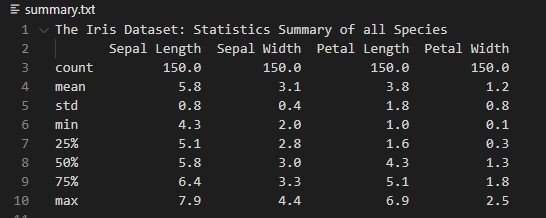
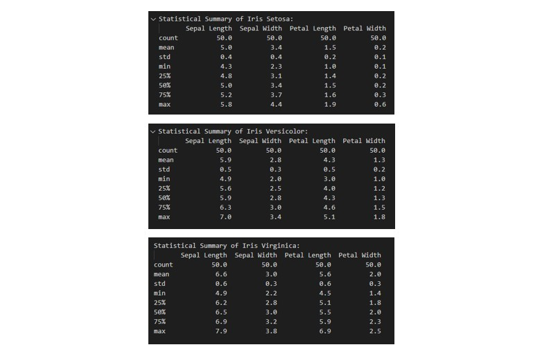

## **PANDS-PROJECT 2021**
### Author: Sarah McNelis
&nbsp;
### **Introduction** 
The aim of this project is to research, investigate and analyse Fisher's Iris data set. I have written a program in python to complete this task. I have also included a full list of references and resources used. First let's take a look at the man behind the data set.
&nbsp;
### **Ronald Fisher**
Sir Ronald Fisher (17 February 1890 – 29 July 1962) was a British statistician, eugenicist, and biologist. One of his most popular developments was the Iris flower data set also known as Fisher's Iris data set. It is a multivariate data set introduced by Ronald Fisher in his 1936 paper on _The use of multiple measurements in taxonomic problems_ as an example of linear discriminant analysis(LDA). The purpose of LDA is to portray the difference between classes of data.
#  
### **Iris Flower Data Set**
The dataset contains a set of 150 records under five attributes - sepal length, sepal width, petal length, petal width and species. 
# 
These records are broken down into three species: Iris-Setosa, Iris-Versicolor and Iris-Virginica. Each species contains 50 records each. Therefore, it is not a surprise that this data set became a popular test case for many statistical classification techniques in machine learning such as support vector machines (SVMs). SVMs are supervised learning models with associated learning algorithms that examine data for classification and analysis.
### **The Research**
- The first step of this project was reseaching the Iris data set. I downloaded the data set in a csv file format. I then decided to explore the different attributes of the data set. I found some images online which clarify which part of Iris flower is the sepal and which part is the petal. Sepals are usually green and offers support and protection to the petal. However, the sepal of the Iris flower is typically a shade of purple. The role of the petal is to surround and protect the reproductive part of the flower.
# 
- The second step was developing code. This required importing various modules required to complete the analysis. Numpy and matplotlib are used for plotting the analysis, seaborn is a good tool for visualisation and pandas is used for analysing the data frame. After this is did a bit of housekeeping. I decided to set the program to only allow one decimal place in the output display as it is neater and easier to read. Next I opened the csv file in read mode in order to begin the analysis. 
- Next I began writing a summary to a text file named summary.txt. I did this opening the file in write mode. I then discovered the function describe() which as you can see below gives a statical summary of the data frame in tabular form.
# 
I then used the variable species which gives a count of each of the different species within the data frame. The shape() function gives the shape of the data frame. In this case it reported the shape as (150,5) which means it consists of 150 rows and 5 columns. Then I decided to break down the statical analysis for each of the three species. 
# 
These tables give a brief summary of each species which are also broken down into four columns showing the sepal length, sepal width, petal length and petal width. I then decided to select the first five rows form the top of the data frame using the head() function and also the last seven rows from the bottom using the tail() function. I subsequently discovered that I could not only select the head and tail of the whole data frame but also the three species specifically as I did with the describle function. As can be seen in the below image there are numerous ways of breaking down and analysing data frames. 
# 
- The next step involved creating histograms of each variable which I have saves as png files in this respository. I decided to creat a histogram for each of the attributes: sepal length, sepal width, petal length, petal width. Within each of these histograms I choose to break down the results showing each attribute of each species as you can see below. 
#### **ENTER IMAGE OF 4 HISTOGRAMS HERE!!!!!!!!! 

&nbsp;

#### para here to explain different **variables**
&nbsp;
#### new para here to explain ** writing to text file**
&nbsp;
#### new para here to explain **histogram of each variable**
&nbsp;
#### new para here to explain ** scatter for each variable**
&nbsp;
## **REFERENCES:**
a

b

c

d
- <<https://www.datasciencemadesimple.com/descriptive-summary-statistics-python-pandas/>>

e

f

g
- <<https://www.geeksforgeeks.org/matplotlib-pyplot-scatter-in-python/>>
- <<https://www.geeksforgeeks.org/plotting-histogram-in-python-using-matplotlib/>>

- <<https://www.geeksforgeeks.org/reading-csv-files-in-python/#:~:text=1%20USing%20csv.reader%20%28%29%3A%20At%20first%2C%20the%20CSV,a%20CSV%20file%20using%20pandas%20library%20functions.%20>>

h

i

j

k
- <<https://www.kaggle.com/arshid/iris-flower-dataset>>
- <<https://www.kaggle.com/saurabh00007/iriscsv>>

l

m

n

o

p
- <<https://pandas.pydata.org/pandas-docs/stable/reference/api/pandas.DataFrame.head.html>>
- <<https://pandas.pydata.org/pandas-docs/stable/reference/api/pandas.DataFrame.shape.html>>
- <<https://pandas.pydata.org/pandas-docs/stable/reference/api/pandas.DataFrame.tail.html>>
- <<https://pandas.pydata.org/docs/reference/api/pandas.DataFrame.describe.html>>
- <<https://pandas.pydata.org/pandas-docs/stable/user_guide/visualization.html >> 
- <<https://pandas.pydata.org/pandas-docs/stable/reference/api/pandas.plotting.scatter_matrix.html>>
- <<https://pandas.pydata.org/pandas-docs/stable/reference/api/pandas.Series.value_counts.html>>
- <<https://pythonspot.com/matplotlib-scatterplot/>>

q

r
- <<https://realpython.com/pandas-groupby/>>
- <<https://realpython.com/python-csv/#:~:text=Reading%20from%20a%20CSV%20file%20is%20done%20using,does%20the%20heavy%20lifting.%20Here%E2%80%99s%20the%20employee_birthday.txt%20file%3A>>
- <<https://realpython.com/python-histograms/>>

s

t
- <<https://towardsdatascience.com/data-analysis-in-python-getting-started-with-pandas-8cbcc1500c83>>

u

v

w
- <<https://en.wikipedia.org/wiki/Iris_flower_data_set>>
- <<https://en.wikipedia.org/wiki/Iris_(plant)>>
- <<https://en.wikipedia.org/wiki/Linear_discriminant_analysis>>
- <<https://en.wikipedia.org/wiki/Machine_learning>>
- <<https://en.wikipedia.org/wiki/Petal>>
- <<https://en.wikipedia.org/wiki/Ronald_Fisher>>
- <<https://en.wikipedia.org/wiki/Sepal>>
- <<https://en.wikipedia.org/wiki/Support-vector_machine>>
- <<https://www.w3schools.com/python/matplotlib_histograms.asp>>
- <<https://www.w3schools.com/python/matplotlib_scatter.asp>>
- <<https://www.w3schools.com/python/python_file_handling.asp>>
x

y

z
